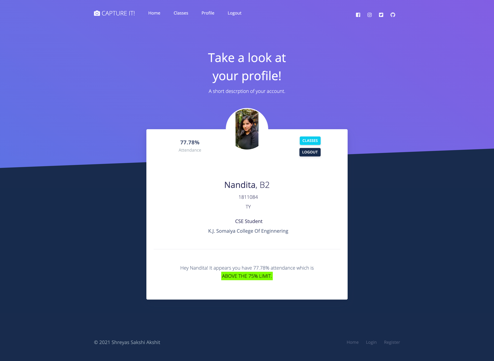

<!--
*** Thanks for checking out the Best-README-Template. If you have a suggestion
*** that would make this better, please fork the repo and create a pull request
*** or simply open an issue with the tag "enhancement".
*** Thanks again! Now go create something AMAZING! :D
***
***
***
*** To avoid retyping too much info. Do a search and replace for the following:
*** staticshreyas, Attendance-Portal, twitter_handle, email, project_title, project_description
-->


<!-- PROJECT SHIELDS -->
<!--
*** I'm using markdown "reference style" links for readability.
*** Reference links are enclosed in brackets [ ] instead of parentheses ( ).
*** See the bottom of this document for the declaration of the reference variables
*** for contributors-url, forks-url, etc. This is an optional, concise syntax you may use.
*** https://www.markdownguide.org/basic-syntax/#reference-style-links
-->
[![Contributors][contributors-shield]][contributors-url]
[![Forks][forks-shield]][forks-url]
[![Stargazers][stars-shield]][stars-url]
[![Issues][issues-shield]][issues-url]
[![MIT License][license-shield]][license-url]


<!-- PROJECT LOGO -->
<br />
<p align="center">
  <a href="https://github.com/staticshreyas/Attendance-Portal">
    
  </a>

  <h3 align="center">Capture It !</h3>

  <p align="center">
    We have built a state of the art attendance recorder. Using face recognition, record attendance hassle free and get access to in depth analysis and wide range of functionalities.
    <br />
    <a href="https://github.com/staticshreyas/Attendance-Portal"><strong>Explore the docs »</strong></a>
    <br />
    <br />
    <a href="https://github.com/staticshreyas/Attendance-Portal">View Demo</a>
    ·
    <a href="https://github.com/staticshreyas/Attendance-Portal/issues">Report Bug</a>
    ·
    <a href="https://github.com/staticshreyas/Attendance-Portal/issues">Request Feature</a>
  </p>
</p>


<!-- TABLE OF CONTENTS -->
<details open="open">
  <summary><h2 style="display: inline-block">Table of Contents</h2></summary>
  <ol>
    <li>
      <a href="#about-the-project">About The Project</a>
      <ul>
        <li><a href="#built-with">Built With</a></li>
      </ul>
    </li>
    <li>
      <a href="#getting-started">Getting Started</a>
      <ul>
        <li><a href="#prerequisites">Prerequisites</a></li>
        <li><a href="#installation">Installation</a></li>
      </ul>
    </li>
    <li><a href="#usage">Usage</a></li>
    <li><a href="#license">License</a></li>
    <li><a href="#contact">Contact</a></li>
    <li><a href="#acknowledgements">Acknowledgements</a></li>
  </ol>
</details>


<!-- ABOUT THE PROJECT -->
## About The Project

We have developed an attendance recorder which records attendance of the students using our face recognition model which has an accuracy of about 97%. 

We have managed to give all possible statistical analysis and hassle free management of attendance of their students.

Detailed explanation of the project is given below.


### Built With

* [NodeJS](https://nodejs.org/en/)
* [ExpressJS](https://expressjs.com/en/starter/generator.html)
* [Python](https://www.python.org/)
* [OpenCV](https://opencv.org/)

<!-- GETTING STARTED -->
## Getting Started

To get a local copy up and running follow these simple steps.

### Prerequisites

Update to the latest version of npm
* npm
  ```sh
  npm install npm@latest -g
  ```

### Installation

1. Clone the repo
   ```sh
   git clone https://github.com/staticshreyas/Attendance-Portal.git
   ```
2. Install NPM packages
   ```sh
   npm install
   ```
3. Install Python packages
   
   ```sh
   cd ./Py-Scrpits 
   pip install requirements.txt
   ```

### Running the project
1. Start the express server from the root directory
   ```sh
   npm start
   ```
2. Start the flask server
    ```sh
    cd ./Py-Scripts
      python app.py
   ```
3. Start the mongo server
    ```sh
    mongod --dbpath YOUR_PATH
   ```

<!-- USAGE  -->
## Usage


#### **Home Page**: Lets take a dive into out portal!


#### **Steps for registration of a student**: 

1. Verify your email 
   
   - 6 digit OTP is sent to the entered email
  
     

     

(**Note:** Only college domain emails accepted)


2.  Fill the registration form
    
     


(**Note:** Cannot create account for an existing roll number)


(**Note:** Password must satisfy specified conditions)


3. Logging in student's account for the first time
   
   - Classrooms page
  
     

   - Profile page
  
     

   - Defaulter page
  
     

#### **Steps for registration of a teacher**: 

1. Verify your email 
   
   - 6 digit OTP is sent to the entered email
  
     

(**Note:** Only college domain emails accepted as mentioned above)

2.  Fill the registration form
    
     


(**Note:** Password must satisfy specified conditions)


3. Logging in teacher's account for the first time
   
   - Dashboard page
  
     

   - Classroom page
  
     

   - Defaulter page
  
     


#### **Steps for creating a new classroom**: 

1. Create a new classroom
  
   - Click "Create new classroom" on the classrooms page
   
     
    - Fill the following form 
  
      

2. View details
  
   - Click "See all" button of a particular classroom on the classrooms page 
   
     

   - Class details page after creating a new class
  
     

#### **Steps for manually adding a student to a new classroom**: 

1. Add students directly 

   - Click "Add students" on the class details page
   
     

    - Add any student by clicking on "+" to add a student to the class
  
       

    - After adding a student classrooms page
  
       

    - After adding a student class details page
  
       

    - Get an email notification when you are added to a class

       


2. Add students using filter 

   - Click "Filters" on the Add Students page
   
     

    - Select any filter/filters
  
       

    - Add any student by clicking on "+" to add a student to the class
  
       

3. Add all students at once

   - Click "Add all" button on the Add Students page (You can add all filtered students as well)
   
     

#### **Steps for joining a classroom with an unique code:** 

1. Copy code
   
   - Copy and send the unique code displayed on the class details page to students using your preferred choice of communication
  
     

2. Enter received code to join a classroom
   
   - A student will receive a code from the teacher. Using this code he can join that particular classroom by entering the code in the box displayed below

     
    
    - Entering wrong code
  
     

    - Entering correct code
  
     

    - Entering code of a class, of which you are already a part
  
     
  
#### **Steps for uploading a picture for face recognition:** 

**Note:** This photo will also be set as a default profile picture of your account!!

1. Upload image form

   - Open the upload image tab in the student's portal

     

   - Select an image in whoch your face is clearly visible (**Note:** Only jpg format is accepted and your image must have the filename as follows 'rollnumber.jpg')
  
    - The image below is blurred for privacy.

     

2. After uploading your image

   - Classrooms page
  
     

   - Profile page
  
     
    

#### **Steps for recording attendance:** 

Log in to your teacher's account.

1. Conduct a lecture

    - Click the "Conduct Lecture" button in the class details to conduct a lecture
  
     


    - After conducting a lecture the lecture number increases as highlighted below. After this step the teacher can start recording the attendance
  
     

2. Record attendance
  

    - Click the "Take attendance" button in the class details to start the camera and record the attendance
  
     


    - A window will open and a camera will start to record the attendance. You can press q to exit the recording frame once you are done recording the attendance
  
    

    - A notification bell sound will be heard once a student is recognised and his/her name will be displayed in the frame as shown below

    

**Note:** Our app supports multiple face detection in a single frame as well.

*To record a mass bunk you need to conduct a lecture by clicking on the above mentioned button, and then start the attendance recorder by clicking on the "Take Attendance" button and then close the camera by pressing "q" on the keyboard. This will be recorded as mass bunk as no students will be present to mark their attendance.*

#### **Statistics based on attendance:** 

1. Dashboard
   
    - Our app calculates numerous statisitics based on the recorded attendance for the teachers to analyse. Below is a screenshot of the dashboard displaying the same.

    

2. Classrooms
   
      - The classroom page displays all the classrooms the teacher has created and displays various stats as displayed below.

    

      - The class details page will also display various stats related to the particular classroom

    

3. Defaulter

   - The teacher can view a list of defaulter students and can also send mail for attendance warning by a click of a single button. (**Note:** You can apply any filter based on the class to sort the students as shown below)

    

   - By clicking the send mail button an email is sent to the students as displayed below

    

4. Student Portal

   - Students can view all the classrooms they are a part of, and view their individual attendance in each of the classes.

    

    - Students can view the classes in which they have attendance less than 75%
    
    

    - Profile of the student will also show whether they have optimal overall attendance

    

    

#### **Exporting to XLSX:** 

1. Attendance export
  
    - You can export the attendance to .xlsx file by clicking on the "Download Attendance button" on the sidenav.
   

    - After the download has completed, you can access the xlsx file in your downloads folder on your local computer
  
      

2. Absentees export

   - Open the form for entering a date by clicking on the "Absent Students" button on the sidenav
  
    - You can select a particular date to find out the people who were absent on that day along with the class name which they didnt attend. If there was a mass bunk it will be displayed as "Mass Bunk".

      
    
    - After selecting the date you can view the absentees
  
      

    - You can export the absentees to xlsx file and download it on your local computer by clicking on the "Download XlS File"
  
      


<!-- LICENSE -->

## License

Distributed under the MIT License. 


<!-- CONTACT -->
## Contact the developers

Shreyas  - shreyas.mm@somaiya.edu

Sakshi - shelar.sa@somaiya.edu

Akshit - akshit.gs@somaiya.edu


<!-- ACKNOWLEDGEMENTS -->
## Acknowledgements

* [Creative Tim](https://www.creative-tim.com/)


[contributors-shield]: https://img.shields.io/github/contributors/staticshreyas/Attendance-Portal.svg?style=for-the-badge
[contributors-url]: https://github.com/staticshreyas/Attendance-Portal/graphs/contributors
[forks-shield]: https://img.shields.io/github/forks/staticshreyas/Attendance-Portal.svg?style=for-the-badge
[forks-url]: https://github.com/staticshreyas/Attendance-Portal/network/members
[stars-shield]: https://img.shields.io/github/stars/staticshreyas/Attendance-Portal.svg?style=for-the-badge
[stars-url]: https://github.com/staticshreyas/Attendance-Portal/stargazers
[issues-shield]: https://img.shields.io/github/issues/staticshreyas/Attendance-Portal.svg?style=for-the-badge
[issues-url]: https://github.com/staticshreyas/Attendance-Portal/issues
[license-shield]: https://img.shields.io/github/license/staticshreyas/Attendance-Portal.svg?style=for-the-badge
[license-url]: https://github.com/staticshreyas/Attendance-Portal/blob/master/LICENSE.txt
[linkedin-shield]: https://img.shields.io/badge/-LinkedIn-black.svg?style=for-the-badge&logo=linkedin&colorB=555
[linkedin-url]: https://linkedin.com/in/staticshreyas
